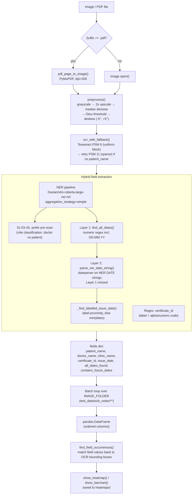

# OCR + Regex + NER Hybrid Field Extraction — `Davlan/xlm-roberta-large-ner-hrl`

Batch pipeline that extracts structured fields (`patient_name`, `doctor_name`,
`clinic_name`, `certificate_id`, `issue_date`, `all_dates_found`) from sick-note
images/PDFs, using OCR for text recognition, a multilingual NER model for
name/org/date entities, and targeted regex only where NER has no matching
entity class.

Notebook: [Text Extraction using OCR+Regex+NER for main data field.ipynb](./Text%20Extraction%20using%20OCR%2BRegex%2BNER%20for%20main%20data%20field.ipynb)

## Architecture

### Pipeline stages

| Stage | Function(s) | Notes |
|---|---|---|
| 1. Discovery | config cell | Recursively scans `test_data/sick_notes/` for `.jpg/.jpeg/.png/.bmp/.tiff/.tif/.pdf` |
| 2. Load | `pdf_page_to_image()`, `Image.open()` | PDFs rendered at 200 DPI via PyMuPDF |
| 3. Preprocess | `preprocess()` | Grayscale → 2× LANCZOS upscale → 3×3 median denoise → Otsu binarisation → deskew |
| 4. OCR | `ocr_text()`, `ocr_bbox()`, `ocr_with_fallback()` | Tesseract, 10 languages loaded together (`eng+deu+fra+spa+ita+nld+pol+por+rus+chi_sim`); PSM 6 default, PSM 11 fallback |
| 5. NER | `_get_ner()` (lazy singleton) | `Davlan/xlm-roberta-large-ner-hrl`, `aggregation_strategy="simple"`; extracts `PER`, `ORG`, `DATE` |
| 6. Field routing | `extract_fields()` | `PER`→patient/doctor (via `Dr./Or./0r.` prefix pre-scan), `ORG`→clinic, regex→`certificate_id` |
| 7. Date resolution | `find_all_dates()`, `parse_ner_date_string()`, `_find_labelled_issue_date()` | Layer 1 numeric regex (cheap) → Layer 2 `dateparser` only on NER `DATE` strings Layer 1 missed → issue date via label-proximity, else earliest date |
| 8. Batch aggregation | batch loop | Per-file try/except so one failure doesn't stop the run; builds `results` list |
| 9. Tabulation | `pandas.DataFrame` | Ordered columns, priority fields first |
| 10. Visual QA | `find_field_occurrences()`, `show_heatmap()`, `show_barchart()` | Maps extracted field values back onto OCR bounding boxes; Gaussian heatmap + occurrence bar chart saved to `heatmaps/` |

## Results & Accuracy

This notebook does **not** currently compute a quantitative accuracy metric
(no precision/recall/F1 against a labelled ground truth). Validation today is
**qualitative**, done via:

- The final `pandas.DataFrame` (Step 3) — manual review of one row per input file.
- The per-image heatmap + bar chart (Step 4) — visually confirms whether an
  extracted value can be located back in the OCR bounding boxes, and whether it
  repeats (e.g. patient name printed more than once).
- `Test_data_Tracking.xlsx` under `test_data/sick_notes/Test data/` tracks test
  document metadata (patient/doctor/clinic/seal/signature/date presence) for a
  *document-authenticity* regression suite — it is not a ground-truth label set
  for this NER extraction pipeline.

Observed qualitative behaviour on the sample documents in `test_data/sick_notes/`:

- **Patient/doctor names** — reliable when the document contains a clear
  `Dr./Or./0r.` prefix (used for doctor/patient role disambiguation) and OCR
  confidence is reasonable; PSM 11 fallback recovers some cases PSM 6 misses on
  stamped/scattered layouts.
- **Dates** — numeric formats (`DD/MM/YYYY`, `DD.MM.YYYY`, `YYYY-MM-DD`,
  `DD.MM.YY`) are resolved with high reliability by the Layer 1 regex; spelled-out
  and non-Latin dates depend on `dateparser` (Layer 2) and are more sensitive to
  OCR noise (e.g. `Auqust` instead of `August`).
- **Certificate ID** — depends entirely on the document containing one of the
  recognised labels (`certificate id/no/nr`, `document no`, `patient id`,
  `cert no`); unlabelled or differently-worded codes are not extracted.
- **Clinic name** — depends on the NER model tagging an `ORG` entity; short or
  stylised clinic names/logos rendered as image text are frequently missed by OCR.

### Improving this further

To get a real accuracy number, add a small labelled set (expected value per
field per file) and compare it against `results` from the batch loop — e.g. an
exact-match or normalised string-similarity score per field, aggregated into
precision/recall per field type. This is not implemented yet in the notebook.
