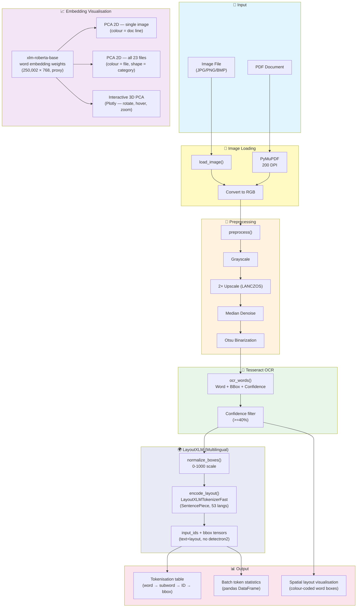

# Layout-Aware Embedding Demonstration using LayoutXLM (Multilingual)

Demonstrates **`microsoft/layoutxlm-base`** as a layout-aware embedding model for OCR
output: Tesseract extracts words and bounding boxes, LayoutXLM's SentencePiece tokeniser
encodes them into subword token IDs with normalised 0-1000 spatial coordinates, and the
notebook visualises the tokenisation table, spatial layout, and embedding space — including
an **interactive rotatable 3D PCA plot** across all 23 test documents.

## What the Model Does

`microsoft/layoutxlm-base` is the **multilingual** variant of LayoutLMv2 — a layout-aware
document understanding transformer built on the XLM-RoBERTa backbone with SentencePiece
tokenisation that covers **53 languages natively**.

**In plain terms:** LayoutXLM-base is an **embedding model for OCR output**. You feed it
the words Tesseract extracted plus their bounding boxes, and it outputs a 768-number vector
for each word — a representation that encodes both *what the word says* and *where it sits
on the page*. It cannot find a patient name, answer a question, or label any field on its
own. It needs a fine-tuned classification head on top to make decisions.

**Important architectural detail:** LayoutXLM is based on LayoutLMv2, which uses a
**detectron2 ResNet visual backbone**. The full multimodal `LayoutLMv2Model` requires
detectron2 installed at runtime. This notebook uses `LayoutXLMTokenizerFast` for
layout-aware encoding and loads `xlm-roberta-base` word embedding weights as a proxy for
the embedding visualisation steps (same 250,002-token SentencePiece vocabulary).

> **Key advantage over LayoutLMv3-base:** LayoutXLM's SentencePiece tokenizer handles
> 53 languages — German, French, Dutch, Spanish, and 49 others — natively, without
> needing separate model checkpoints. This makes it the correct base model for sick notes
> issued in non-English-speaking countries.

> **To get model-driven key/value extraction**, you would (a) install `detectron2`,
> (b) load `LayoutLMv2Model`, and (c) fine-tune a token-classification head on a dataset
> like XFUND (multilingual form understanding). See `impira/layoutlm-document-qa` or
> `naver-clova-ix/donut-base-finetuned-docvqa` in this repo for ready-to-use extractors.

## Key Features

- **Multilingual layout-aware encoding** — SentencePiece tokenizer + 0-1000 bbox
  normalisation covers 53 languages
- **No detectron2 required** — tokenizer-only mode runs on any platform including
  macOS Apple Silicon
- **Tokenisation table** — shows every OCR word, its subword tokens, token IDs, and
  normalised bounding box coordinates in a readable DataFrame
- **Spatial layout visualisation** — draws colour-coded OCR word bboxes on the document
  image to show what LayoutXLM's layout encoding represents
- **Batch token statistics** — token count, subword split ratio, non-Latin word count
  across the full image dataset
- **PCA embedding visualisation (single image)** — projects word embedding vectors to 2D,
  coloured by document line number
- **Multi-file PCA comparison (2D)** — all 23 test documents in one plot; colour = file,
  shape = category (Test data / authentic / fake / suspicious)
- **Interactive 3D embedding plot (Plotly)** — fully rotatable PCA 3D scatter with hover
  tooltips, per-file colour, per-category shape, grouped legend
- **Confidence-based filtering** — removes low-confidence OCR words (default >= 40%)
- **Multi-language OCR** — Tesseract supports English, German, French, Spanish, Italian, Dutch
- **Smart PDF handling** — renders PDF pages via PyMuPDF at 200 DPI
- **Lazy model loading** — tokeniser and embedding weights each load once and are cached

## Notebook Pipeline



## Model Details

| Property | Value |
|---|---|
| Model ID | `microsoft/layoutxlm-base` |
| Architecture | LayoutXLM (LayoutLMv2-based, multilingual) |
| Backbone | XLM-RoBERTa with SentencePiece tokenizer |
| Languages | 53 (SentencePiece vocabulary) |
| Input (this notebook) | OCR tokens + normalised bounding boxes (0-1000) |
| Input (full model) | Image + OCR tokens + bboxes + detectron2 visual features |
| Output (this notebook) | `input_ids`, `attention_mask`, `token_type_ids`, `bbox` tensors |
| Output (full model) | Layout-aware token embeddings (`last_hidden_state`) |
| Hidden size | 768 |
| Tokenizer download | ~1 MB |
| Full model size | ~500 MB |
| License | **CC BY-NC-SA 4.0 — non-commercial only** |

### Comparison with Other Approaches

| Approach | Layout Info | Visual Info | Multilingual | Field Extraction |
|----------|-------------|-------------|--------------|------------------|
| **OCR + Regex** | No | No | Tesseract only | Rule-based patterns |
| **OCR + NER** | No | No | Model-dependent | Named entity recognition |
| **LayoutLM v1 QA** | Yes (boxes) | No | No (English) | Question-answering |
| **LayoutLMv3-base** | Yes (boxes) | Yes (patches) | No (English) | Requires fine-tuning |
| **LayoutXLM-base (this)** | Yes (boxes) | No* | Yes (53 langs) | Requires fine-tuning |

*Visual backbone requires detectron2 — not loaded in this notebook.

## Model Statistics

### Model Architecture

| Property | Value |
|----------|-------|
| Parameters | **375M** (LayoutLMv2-base scale) |
| Hidden size | 768 |
| Attention heads | 12 |
| Layers | 12 |
| Vocabulary size | 250,002 (SentencePiece) |
| Max position embeddings | 512 |

### Benchmark Results (Fine-tuned on XFUND)

XFUND is an 8-language multilingual form understanding benchmark covering Chinese,
Japanese, Spanish, French, Italian, German, Portuguese, and Korean.

| Language | Precision | Recall | F1 Score |
|----------|-----------|--------|----------|
| ZH (Chinese) | 88.25% | 90.74% | **89.48%** |
| JA (Japanese) | 78.07% | 78.07% | **78.07%** |
| ES (Spanish) | 77.95% | 83.23% | **80.50%** |
| FR (French) | 77.85% | 83.54% | **80.60%** |
| IT (Italian) | 78.12% | 84.15% | **81.02%** |
| DE (German) | 80.23% | 85.24% | **82.65%** |
| PT (Portuguese) | 78.89% | 84.56% | **81.62%** |
| KO (Korean) | 76.78% | 82.24% | **79.41%** |

> **Note:** These benchmarks are for the fine-tuned model. The tokenizer-only mode used
> in this notebook produces layout-aware input tensors — fine-tuning on a task-specific
> dataset is required to achieve these scores.

### Notebook Results (Sick Notes — Token Statistics)

Batch results from running Step 7 across all 23 test images:

| Metric | Value |
|--------|-------|
| Images processed | **23** |
| Avg OCR words per image | **145.9** |
| Avg LayoutXLM tokens per image | **239.8** |
| Avg subword ratio (tokens / words) | **1.68×** |
| Total non-Latin words found | **22** |

**Observations:**
- Subword ratio of 1.68× means each OCR word becomes ~1.7 SentencePiece tokens on
  average — compound words, dates, and medical terms account for most splits
- `sick_note_19.png` had the highest ratio (2.06×) and `date_mismatch.png` the most
  aggressive splitting (2.16×), likely due to non-standard formatting
- 22 non-Latin characters across 23 documents confirms multilingual content that
  LayoutXLM handles natively (German umlauts, accented names)

## Tokenisation Explained

### SentencePiece Word Splitting

LayoutXLM's XLM-RoBERTa tokeniser may split a single OCR word into multiple subword
pieces. The word-start marker prefix (shown as `▁` in token strings) indicates the
beginning of a new word.

| OCR Word | Subword Tokens | Pieces |
|----------|---------------|--------|
| `Patient` | `▁Patient` | 1 |
| `Krankenhaus` | `▁Kran` `ken` `haus` | 3 |
| `Müller` | `▁Müller` | 1 |
| `certificat` | `▁certif` `icat` | 2 |

### Normalised Bounding Box

Every subword token inherits the normalised bbox of its parent OCR word:

| Pixel coord (from Tesseract) | Normalised (0-1000 scale) |
|------------------------------|--------------------------|
| `x=120, y=80` on 1200px wide, 1600px tall image | `x0=100, y0=50` |
| `x+w=360, y+h=110` | `x1=300, y1=68` |

## Embedding Visualisation

Steps 8–10 use word embedding weights from `xlm-roberta-base` as a proxy (same 250,002
SentencePiece vocabulary and identical token IDs; only weights differ slightly from the
full LayoutXLM model which needs detectron2).

### Step 8 — Single Image PCA (2D)
- Each point = one OCR word from the inspected image
- Colour = document line number
- Shows whether words on the same line cluster together in embedding space

### Step 9 — Multi-File PCA (2D)
- All 23 test documents plotted together
- **Colour** = individual file (unique HSV colour per file)
- **Marker shape** = document category

| Shape | Category |
|---|---|
| circle `o` | Test data |
| filled-plus `P` | authentic |
| diamond `D` | fake |
| triangle `^` | suspicious |

### Step 10 — Interactive 3D PCA (Plotly)
- Same data as Step 9 projected into 3 principal components
- **Drag** to rotate freely in 3D space
- **Scroll** to zoom in/out
- **Hover** over any point for word text, filename, category, PC1/PC2/PC3 values
- **Click legend entry** to hide/show individual files
- **Click category group title** to toggle whole category

Set `SHOW_LABELS_3D = True` to annotate every point with its word text.

## Notebook Walkthrough

**File:** `Layout-Aware Field Extraction using LayoutXLM (Multilingual).ipynb`

| Step | Purpose |
|------|---------|
| **0. Environment Setup** | Adds project root to `sys.path` |
| **Configuration and Image Discovery** | Sets `IMAGE_FOLDER`, `INSPECT_INDEX`, `EXTENSIONS`; lists all matching files |
| **1. OCR and Image Helpers** | `load_image()`, `preprocess()`, `ocr_words()`, `pdf_page_to_image()` |
| **2. LayoutXLM Tokeniser Setup** | Lazily loads `LayoutXLMTokenizerFast` singleton (~1 MB on first call) |
| **3. Layout-Aware Encoding** | `normalize_boxes()`, `encode_layout()` — multilingual text+bbox tensors |
| **4. Inspect a Single Image** | Load one image, run OCR, produce and print encoding tensors |
| **5. Tokenisation Table** | DataFrame: OCR word, subword tokens, token IDs, pixel bbox, normalised bbox |
| **6. Spatial Layout Visualisation** | Colour-coded OCR word bboxes drawn on the original document image |
| **7. Batch Token Statistics** | Token count, subword ratio, non-Latin words across all images |
| **Results DataFrame** | `pandas.DataFrame` with per-image token statistics + summary |
| **8. Embedding Visualisation (PCA 2D)** | Single-image PCA scatter, colour = document line |
| **9. Multi-File Comparison (PCA 2D)** | All 23 files in one 2D plot, colour = file, shape = category |
| **10. Interactive 3D Plot (Plotly)** | Rotatable PCA 3D scatter — drag, zoom, hover, toggle legend |

## Prerequisites

```bash
# Core dependencies (all already in requirements.txt)
pip install transformers sentencepiece torch pillow
pip install pytesseract pymupdf numpy pandas

# Embedding visualisation
pip install scikit-learn matplotlib
pip install plotly          # interactive 3D plot (Step 10)

# Tesseract OCR binary
brew install tesseract tesseract-lang   # macOS
sudo apt-get install tesseract-ocr      # Ubuntu/Debian
```

## Usage

1. Open `Layout-Aware Field Extraction using LayoutXLM (Multilingual).ipynb`
2. Run cells top to bottom — Step 0 sets up imports, Configuration sets `IMAGE_FOLDER`
3. Step 2 downloads the SentencePiece tokenizer (~1 MB, one-time)
4. Step 4 shows the encoding tensors for one image (`INSPECT_INDEX`)
5. Step 5 prints the tokenisation table (OCR word → subword tokens → normalised bbox)
6. Step 6 draws colour-coded word bboxes on the document image
7. Step 7 runs over all images and prints batch token statistics
8. Step 8 runs PCA on one image's word embeddings and plots a 2D scatter (colour = line)
9. Step 9 runs PCA on all 23 images and plots a 2D comparison (colour = file, shape = category)
10. Step 10 produces the interactive 3D Plotly plot — drag to rotate, hover for details

## Limitations

- **Tokenizer-only mode** — LayoutXLM's visual backbone (detectron2 ResNet) is not
  loaded; layout encoding uses text + bbox only
- **Proxy embeddings** — Steps 8–10 use `xlm-roberta-base` word embedding weights as a
  stand-in; the full LayoutXLM contextual embeddings require `LayoutLMv2Model` +
  detectron2 and will differ slightly
- **Static word embeddings** — the PCA plots show the word embedding lookup layer, not
  contextual embeddings; positional and layout context from the transformer layers is not
  captured
- **License restriction** — CC BY-NC-SA 4.0 limits commercial use
- **GPU optional** — tokenizer and word embedding lookup run on CPU; full model would
  benefit from MPS/CUDA

## Future Improvements

- **Install detectron2** — load the full `LayoutLMv2Model` for true contextual 768-dim
  layout-aware embeddings
- **Fine-tune token classification** — train on XFUND for model-driven multilingual field
  extraction
- **t-SNE / UMAP visualisation** — alternative dimensionality reduction that often
  produces tighter, more interpretable clusters than PCA
- **Connect to a QA head** — pair with `impira/layoutlm-document-qa` for zero-shot
  field extraction using this model's spatial representations
- **GPU/MPS acceleration** — move full model to GPU for faster inference
