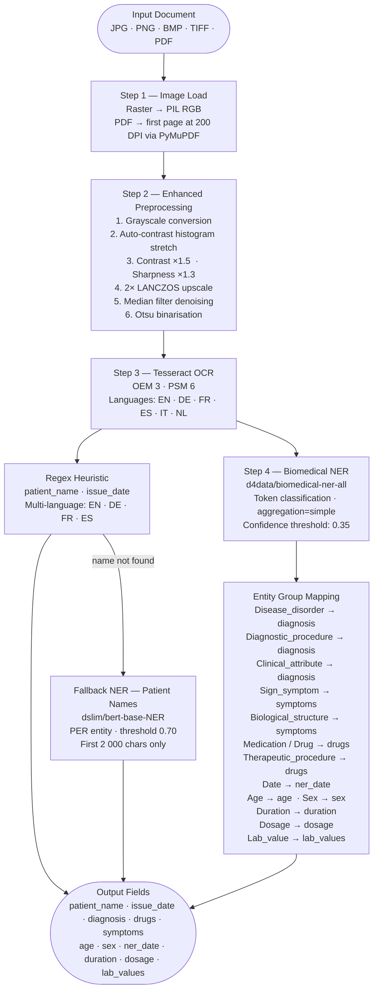

# Clinical Entity Extraction — `d4data/biomedical-ner-all`

## Domain

This model is specialised for the **clinical / biomedical domain**. It extracts structured medical entities from free-form clinical text such as sick notes, discharge summaries, referral letters, and other healthcare documents. It is trained on biomedical corpora and recognises a wide range of clinical entity types including diseases, medications, symptoms, lab values, and patient demographics.

---

## Pipeline Architecture



---

## Models & Tools

| Component | Details |
|---|---|
| **Primary NER** | `d4data/biomedical-ner-all` |
| **Fallback NER** | `dslim/bert-base-NER` (patient name via `PER` entity) |
| **OCR engine** | Tesseract (`pytesseract`) with enhanced preprocessing |
| **PDF rendering** | PyMuPDF (`fitz`) |
| **Confidence threshold** | 0.35 (lowered from 0.5 for better recall on OCR-noisy text) |
| **Model task** | Token classification |
| **License** | Apache 2.0 |

---

## Extracted Fields

### Primary Fields

| Field | Source | Description |
|---|---|---|
| `patient_name` | Regex heuristic → NER fallback | Patient's full name |
| `issue_date` | Regex heuristic | Date the document was issued |
| `diagnosis` | Biomedical NER | Disease, diagnostic procedure, clinical attribute |
| `drugs` | Biomedical NER | Medications and therapeutic procedures |
| `symptoms` | Biomedical NER | Signs, symptoms, biological structures |

### Bonus Fields

| Field | Source | Description |
|---|---|---|
| `age` | Biomedical NER | Patient age |
| `sex` | Biomedical NER | Patient sex / gender |
| `ner_date` | Biomedical NER | Any dates found in the text |
| `duration` | Biomedical NER | Duration of illness or rest |
| `dosage` | Biomedical NER | Drug dosage information |
| `lab_values` | Biomedical NER | Laboratory measurement values |

---

## Benchmark Results (23 sick-note test images)

| Field | Extracted | Rate |
|---|---|---|
| `patient_name` | 23 / 23 | 100.0 % |
| `issue_date` | 21 / 23 | 91.3 % |
| `ner_date` | 19 / 23 | 82.6 % |
| `diagnosis` | 14 / 23 | 60.9 % |
| `drugs` | 13 / 23 | 56.5 % |
| `symptoms` | 13 / 23 | 56.5 % |
| `lab_values` | 12 / 23 | 52.2 % |
| `duration` | 10 / 23 | 43.5 % |
| `age` | 3 / 23 | 13.0 % |
| `dosage` | 2 / 23 | 8.7 % |
| `sex` | 1 / 23 | 4.3 % |

**Overall primary field extraction rate: 73.0 %**

---

## Why This Model Cannot Extract Patient Names

### The model was trained on the wrong type of data

`d4data/biomedical-ner-all` is trained on **biomedical research literature** — scientific papers, clinical trial reports, and medical abstracts. In that domain, patient names never appear. Papers say *"a 45-year-old female patient"*, never *"John Smith"*. The model was therefore never shown what a person's name looks like in context and has no concept of it.

This is why the pipeline uses a **regex heuristic first**, then falls back to `dslim/bert-base-NER` (trained on news text where recognising people's names is the primary task) when the regex finds nothing.

---

### What entity types the model actually knows

The following entity groups are what the model was trained to recognise. Notice that `Person`, `Patient`, or `Name` is entirely absent.

| Entity Group | Examples |
|---|---|
| `Disease_disorder` | hypertension, pharyngitis, influenza |
| `Sign_symptom` | fever, sore throat, fatigue |
| `Medication` / `Drug` | amoxicillin, ibuprofen, paracetamol |
| `Diagnostic_procedure` | blood sugar test, chest X-ray |
| `Therapeutic_procedure` | bed rest, physiotherapy |
| `Clinical_attribute` | blood pressure, heart rate |
| `Biological_structure` | throat, lung, lymph node |
| `Lab_value` | 47 mg/dL, 120/80 mmHg |
| `Age` | 45 years old, 6-month-old |
| `Sex` | female, male |
| `Date` | May 19 2021, 15.01.2024 |
| `Duration` | 1 week, 3 days |
| `Dosage` | 500 mg twice daily |

**There is no `Person`, `Patient`, `Name`, or `PER` entity group in this model.**

---

### Technical reason — the training datasets

The model is trained on a combination of annotated biomedical corpora, including:

| Dataset | Focus |
|---|---|
| **BC5CDR** | Chemical and disease names in PubMed abstracts |
| **NCBI Disease** | Disease mentions in biomedical literature |
| **i2b2** | De-identified clinical notes (names already removed) |
| **BioNLP** | Biological event and entity extraction |
| **JNLPBA** | Protein, DNA, RNA, cell-line, cell-type entities |

Two reasons patient names are absent from all of these:

1. **Legal de-identification** — clinical data published for research is stripped of all patient identifiers (names, addresses, dates of birth) under HIPAA / GDPR before release. By the time the data reaches a training corpus, names are replaced with placeholders like `[NAME]` or `[PATIENT]`.

2. **Task scope** — these datasets were designed to solve *clinical concept extraction* (finding diseases, drugs, symptoms), not *named entity recognition for people*. Patient names are considered noise, not signal, for that task.

---

### Model comparison for patient name extraction

| Model | Trained on | Knows patient names? | Used in this pipeline for |
|---|---|---|---|
| `d4data/biomedical-ner-all` | Biomedical research papers | No — names removed from training data | Clinical entities (diagnosis, drugs, symptoms) |
| `dslim/bert-base-NER` | CoNLL-2003 news corpus | Yes — `PER` is its primary entity type | Patient name fallback only |

---

### How to fix this long-term

The only robust solution is to **fine-tune a model** on labelled sick-note data where `PATIENT_NAME` and `ISSUE_DATE` are explicit entity types. Until then, the regex + `dslim/bert-base-NER` fallback approach in this pipeline is the correct design.

---

## Dependencies

```bash
pip install transformers torch pillow pytesseract pymupdf numpy pandas
brew install tesseract tesseract-lang   # macOS — adjust for your OS
```

---

## Notebook

See [Clinical Entity Extraction using Biomedical NER.ipynb](Clinical%20Entity%20Extraction%20using%20Biomedical%20NER.ipynb) for the full end-to-end implementation.
