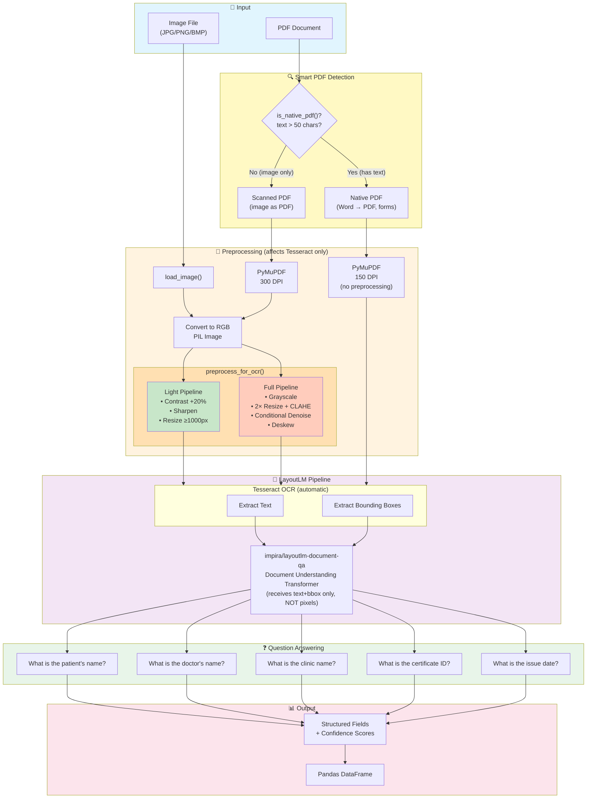

# Document Field Extraction using LayoutLM (Visual Question Answering)

Extracts structured fields (patient name, doctor name, clinic name, certificate ID, issue date) from medical certificates / sick notes using the `impira/layoutlm-document-qa` model — a document understanding transformer that answers natural-language questions about a document image.

## What the Model Does

`impira/layoutlm-document-qa` is a fine-tuned **LayoutLM v1** model for **extractive document question answering**. Instead of relying on hand-written regex or a general-purpose NER model, you simply *ask a question* (e.g. *"What is the patient's name?"*) and the model returns the answer text plus a confidence score.

**Important architectural detail:** LayoutLM v1 is **not a vision model** — it never sees raw image pixels. It only receives:
1. **OCR text** extracted by Tesseract
2. **2D bounding boxes** for each word (layout position on the page)

This means the model reasons about *where text sits on the page* (e.g. "this word is in the top-right corner, near the label 'Date:'") rather than about visual appearance. Consequently, any image preprocessing only matters insofar as it improves **Tesseract's OCR accuracy** — it does not feed into the model directly.

## Key Features

- **Zero-shot field extraction** — no training/fine-tuning required, just ask questions
- **Multi-question voting** — each field is queried with 4–8 phrasing variants; the highest-confidence answer wins
- **Confidence-based filtering** — answers below `MIN_CONFIDENCE` (0.3) are discarded as unreliable/hallucinated
- **Ambiguity-resistant questions** — questions use explicit labels (e.g. `"Patient Name:"` vs `"Dr."`) to avoid confusing patient/doctor names
- **Smart PDF handling** — detects native (text-layer) PDFs vs scanned PDFs and adapts DPI/preprocessing accordingly
- **Two OCR preprocessing pipelines** — selectable "light" and "full" pipelines to match document quality
- **Batch processing** — runs over an entire folder of images/PDFs and produces a pandas DataFrame + summary stats
- **Lazy model loading** — the ~500 MB model loads once and is cached for the session

## Two Preprocessing Pipelines

Since preprocessing only affects OCR quality (not the model), two pipelines are provided to match different document conditions:

| Pipeline | Mode | Best For | Steps |
|----------|------|----------|-------|
| **Light** | `"light"` | Clean documents, digital scans | Contrast +20% → Sharpen → Resize ≥1000px |
| **Full** | `"full"` | Scanned/faded/noisy/skewed documents | Grayscale → 2× Resize + CLAHE → Conditional denoise → Deskew |

Set `PREPROCESSING_MODE = "light"` / `"full"` / `"none"` in the helper-functions cell to switch pipelines.

### Smart PDF Detection

| PDF Type | Detection | DPI | Preprocessing | Why |
|----------|-----------|-----|---------------|-----|
| **Native PDF** (Word → PDF, digital forms) | `get_text()` > 50 chars | 150 | ❌ Skipped | Text is vector-based, always crisp |
| **Scanned PDF** (image saved as PDF) | `get_text()` ≤ 50 chars | 300 | ✅ Selected pipeline | Image needs enhancement for OCR |

## Architecture



### Model Details

| Property | Value |
|---|---|
| Model ID | `impira/layoutlm-document-qa` |
| Architecture | LayoutLM v1 (document understanding transformer) |
| Pipeline type | `document-question-answering` (Hugging Face `transformers`) |
| Input | Image (rendered to PIL) + question string |
| Output | `{"answer": str, "score": float, "start": int, "end": int}` |
| Size | ~500 MB |

**Difference from a traditional OCR + NER pipeline:**
- **OCR + NER**: Image → Tesseract text → NER model → entity extraction → post-processing rules
- **LayoutLM QA**: Image → ask question → get answer directly (end-to-end, layout-aware)

## Notebook Walkthrough

**File:** `Document QA Field Extraction using LayoutLM.ipynb`

| Step | Purpose |
|------|---------|
| **0. Environment Setup** | Adds project root to `sys.path`; adds Homebrew's `tesseract` binary to `$PATH` |
| **Configuration & Image Discovery** | Sets `IMAGE_FOLDER`, `INSPECT_INDEX`, `EXTENSIONS`; lists all matching files |
| **1. Helper Functions** | `is_native_pdf()`, `preprocess_light()`, `preprocess_full()`, `preprocess_for_ocr()`, `pdf_page_to_image()`, `load_image()` |
| **2. Model Setup** | Lazily loads the `impira/layoutlm-document-qa` pipeline (singleton, ~30–60s on first call) |
| **3. Field Extraction** | `_FIELD_QUESTIONS` (question variants per field), `_ask_question()`, `extract_fields_qa()` |
| **4. Inspect a Single Image** | Loads/displays one image and runs extraction with per-field confidence indicators |
| **5. Batch Processing** | Runs extraction over every file in `IMAGE_FOLDER`, builds a results list, converts to a `pandas.DataFrame` |
| **6. Summary Statistics** | Per-field extraction rate (%) and average confidence across the batch |
| **Appendix** | Scratchpad for testing custom questions against the inspection image |

### Output Format

```python
{
    "patient_name": "John Smith",
    "patient_name_confidence": 0.95,
    "doctor_name": "Dr. Anna Müller",
    "doctor_name_confidence": 0.88,
    "clinic_name": "...",
    "clinic_name_confidence": 0.0,   # not found (below MIN_CONFIDENCE)
    "certificate_id": "...",
    "certificate_id_confidence": 0.71,
    "issue_date": "...",
    "issue_date_confidence": 0.93,
}
```

### Avoiding Field Confusion

Generic questions like `"What name appears after 'Name:'?"` can match either the patient or doctor section. Questions are phrased with explicit labels to disambiguate:
- ✅ `"What name appears after 'Patient Name:' or 'Patient:'?"` → patient-specific
- ✅ `"What name appears after 'Dr.' or 'Physician:'?"` → doctor-specific

## Prerequisites

```bash
pip install transformers torch pillow   # LayoutLM pipeline (~500 MB download on first run)
pip install pymupdf                     # PDF rendering
pip install opencv-python numpy         # Full preprocessing pipeline (CLAHE, denoise, deskew)
pip install pandas                      # Results DataFrame

# Tesseract OCR binary (required internally by the HF pipeline)
brew install tesseract        # macOS
sudo apt-get install tesseract-ocr   # Ubuntu/Debian
# Windows: https://github.com/UB-Mannheim/tesseract/wiki
```

## Usage

1. Open `Document QA Field Extraction using LayoutLM.ipynb`.
2. Run cells top to bottom — Step 0 sets up `PATH`/imports, Configuration sets `IMAGE_FOLDER`.
3. Set `PREPROCESSING_MODE` (`"light"` / `"full"` / `"none"`) in the helper-functions cell.
4. Run Step 4 to sanity-check extraction on one image (`INSPECT_INDEX`).
5. Run Step 5 to batch-process the whole folder, then Step 6 for summary stats.
