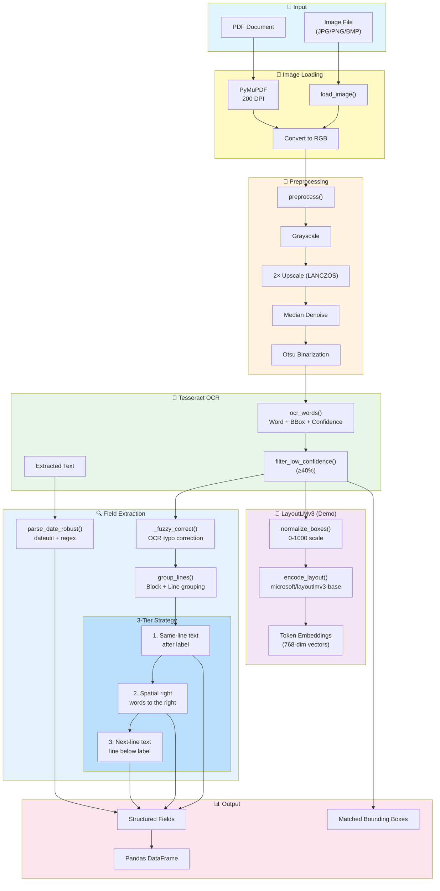

# Layout-Aware Field Extraction using LayoutLMv3 (OCR + Layout Encoding)

Extracts structured fields (patient name, doctor name, clinic name, certificate ID, issue date) from medical certificates / sick notes using **Tesseract OCR** for text + word geometry, **`microsoft/layoutlmv3-base`** for layout-aware token encoding, and a **label-proximity heuristic** with optimizations for robust extraction.

## What the Model Does

`microsoft/layoutlmv3-base` is a **layout-aware document understanding transformer** that produces **contextual embeddings** for tokens based on their text content, visual appearance, and spatial position on the page.

**Important architectural detail:** Unlike LayoutLM v1, LayoutLMv3 is a **multimodal model** that processes:
1. **Text tokens** — words extracted via OCR
2. **2D bounding boxes** — normalized coordinates (0–1000 scale) for each word
3. **Image patches** — the actual document image pixels

However, `microsoft/layoutlmv3-base` is a **base checkpoint with no classification head** — it produces layout-aware *embeddings*, not field labels directly. This notebook therefore uses LayoutLMv3 to demonstrate layout-aware encoding and performs actual key/value extraction with an **OCR label-proximity heuristic** over the Tesseract word boxes.

> **To get model-driven key/value labels**, you would fine-tune a token-classification head on a dataset like FUNSD, CORD, or SROIE.

## Key Features

- **Layout-aware encoding** — LayoutLMv3 fuses text, layout, and visual features for document understanding
- **Label-proximity heuristic** — finds field values by locating label keywords and reading adjacent text
- **Fuzzy OCR matching** — corrects common OCR typos (e.g., "patienf" → "patient", "d0ctor" → "doctor")
- **Spatial proximity search** — looks for values to the right of labels, not just inline text
- **Confidence-based filtering** — removes low-confidence OCR words (default ≥40%)
- **Robust date parsing** — uses `dateutil` for multi-format date handling (falls back to regex)
- **Multi-language OCR** — supports English, German, French, Spanish, Italian, Dutch
- **Smart PDF handling** — renders PDF pages via PyMuPDF at 200 DPI
- **Batch processing** — runs over an entire folder and produces a pandas DataFrame + summary stats
- **Lazy model loading** — the ~500 MB model loads once and is cached for the session

## Extraction Pipeline



## Model Details

| Property | Value |
|---|---|
| Model ID | `microsoft/layoutlmv3-base` |
| Architecture | LayoutLMv3 (multimodal document transformer) |
| Input | Image + OCR tokens + normalized bounding boxes (0–1000) |
| Output | Layout-aware token embeddings (`last_hidden_state`) |
| Hidden size | 768 |
| Size | ~500 MB |
| License | **CC BY-NC-SA 4.0 — non-commercial only** |

### Comparison with Other Approaches

| Approach | Layout Info | Visual Info | Field Extraction |
|----------|-------------|-------------|------------------|
| **OCR + Regex** | ❌ | ❌ | Rule-based patterns |
| **OCR + NER** | ❌ | ❌ | Named entity recognition |
| **LayoutLM v1 QA** | ✅ Boxes | ❌ | Question-answering |
| **LayoutLMv3 (this)** | ✅ Boxes | ✅ Image patches | Label-proximity heuristic* |

*Fine-tuning LayoutLMv3 for token classification would enable model-driven extraction.

## Model Statistics

### Model Architecture

| Property | Value |
|----------|-------|
| Parameters | **133M** (0.1B) |
| Hidden size | 768 |
| Attention heads | 12 |
| Layers | 12 |
| Vocabulary size | 50,265 |
| Max position embeddings | 512 |
| Downloads (monthly) | ~1.1M |

### Benchmark Results (Fine-tuned)

When fine-tuned on downstream tasks, LayoutLMv3 achieves state-of-the-art results:

#### FUNSD (Form Understanding)

| Model | Precision | Recall | F1 Score |
|-------|-----------|--------|----------|
| LayoutLMv3-base | 89.55% | 91.65% | **90.59%** |
| LayoutLMv3-large | 92.19% | 92.10% | **92.15%** |

#### PubLayNet (Document Layout Analysis)

| Model | Text | Title | List | Table | Figure | mAP |
|-------|------|-------|------|-------|--------|-----|
| LayoutLMv3-base | 94.5 | 90.6 | 95.5 | 97.9 | 97.0 | **95.1** |

#### XFUND-ZH (Chinese Form Understanding)

| Model | Precision | Recall | F1 Score |
|-------|-----------|--------|----------|
| LayoutLMv3-base-chinese | 89.80% | 94.35% | **92.02%** |

#### RVL-CDIP (Document Image Classification)

| Model | Accuracy |
|-------|----------|
| LayoutLMv3-base | **95.44%** |
| LayoutLMv3-large | **95.93%** |

#### DocVQA (Document Visual Question Answering)

| Model | ANLS Score |
|-------|------------|
| LayoutLMv3-base | 78.76 |
| LayoutLMv3-large | **83.37** |

> **Note:** These benchmarks are for fine-tuned models. The base checkpoint used in this notebook produces embeddings only — fine-tuning is required to achieve these scores.

### Notebook Results (Medical Certificates)

Extraction results from running this notebook on 23 medical certificate / sick note images:

| Field | Extracted | Total | Rate |
|-------|-----------|-------|------|
| patient_name | 21 | 23 | **91.3%** |
| doctor_name | 19 | 23 | **82.6%** |
| clinic_name | 17 | 23 | **73.9%** |
| issue_date | 12 | 23 | **52.2%** |
| certificate_id | 3 | 23 | **13.0%** |

**Observations:**
- **Patient/doctor names** extract reliably due to common label patterns ("Patient:", "Name:", "Dr.")
- **Clinic names** often found via "Clinic:", "Hospital:", "Practice:" labels
- **Issue dates** vary in format — `dateutil` handles most, but handwritten dates may fail OCR
- **Certificate IDs** are inconsistent across documents (different label styles, positions, or absent)

## Field Extraction Optimizations

### Fuzzy OCR Matching

Common OCR misreads are automatically corrected:

| Correct | OCR Variants Recognized |
|---------|------------------------|
| patient | patienf, pationt, patlent, pat1ent |
| doctor | docter, docfor, d0ctor, dootor |
| clinic | cllnic, clinlc, cl1nic |
| hospital | hospltal, hosp1tal, hospita1 |
| certificate | certificafe, cert1ficate, certlficate |

### 3-Tier Extraction Strategy

1. **Same-line** — text immediately following the label keyword
2. **Spatial right** — words geometrically positioned to the right of the label box
3. **Next-line** — text on the line below the label

### Confidence Filtering

Words with OCR confidence below `MIN_CONFIDENCE` (40%) are filtered out to reduce noise. If filtering removes >70% of words, the original set is used (for low-quality images).

## Notebook Walkthrough

**File:** `Layout-Aware Field Extraction using LayoutLMv3.ipynb`

| Step | Purpose |
|------|---------|
| **0. Environment Setup** | Adds project root to `sys.path` |
| **Configuration & Image Discovery** | Sets `IMAGE_FOLDER`, `INSPECT_INDEX`, `EXTENSIONS`; lists all matching files |
| **1. OCR & Image Helpers** | `load_image()`, `preprocess()`, `ocr_words()`, `ocr_text()`, `pdf_page_to_image()` |
| **2. LayoutLMv3 Model Setup** | Lazily loads `microsoft/layoutlmv3-base` (singleton, ~30–60s on first call) |
| **3. Layout-Aware Encoding** | `normalize_boxes()`, `encode_layout()` — demonstrates LayoutLMv3 running on a document |
| **4. Field Extraction (Optimized)** | Fuzzy matching, spatial proximity, confidence filtering, robust date parsing |
| **5. Inspect a Single Image** | Loads/displays one image, runs layout encoding check, extracts fields |
| **6. Batch Processing** | Runs extraction over every file in `IMAGE_FOLDER`, builds a results list |
| **Results DataFrame** | Converts results to `pandas.DataFrame` with human-friendly column order |
| **7. Summary Statistics** | Per-field extraction rate (%) across the batch |
| **Appendix** | Visualizes matched field bounding boxes on the preprocessed image |

### Output Format

```python
{
    "patient_name": "John Smith",
    "doctor_name": "Dr. Anna Müller",
    "clinic_name": "City Medical Center",
    "certificate_id": "REF-2024-001",
    "issue_date": "2024-08-15",  # Normalized by dateutil if available
}
```

### Bounding Box Visualization

The appendix draws color-coded boxes around matched field lines:

| Field | Color |
|-------|-------|
| patient_name | 🔴 Red |
| doctor_name | 🔵 Blue |
| clinic_name | 🟢 Green |
| certificate_id | 🟣 Purple |

## Prerequisites

```bash
# Core dependencies
pip install transformers torch pillow   # LayoutLMv3 (~500 MB download on first run)
pip install pytesseract                 # Tesseract Python wrapper
pip install pymupdf                     # PDF rendering
pip install numpy pandas                # Data processing

# Optional (for robust date parsing)
pip install python-dateutil

# Tesseract OCR binary
brew install tesseract tesseract-lang   # macOS (includes language packs)
sudo apt-get install tesseract-ocr      # Ubuntu/Debian
# Windows: https://github.com/UB-Mannheim/tesseract/wiki
```

## Usage

1. Open `Layout-Aware Field Extraction using LayoutLMv3.ipynb`
2. Run cells top to bottom — Step 0 sets up imports, Configuration sets `IMAGE_FOLDER`
3. Adjust `MIN_CONFIDENCE` (default 40%) in Step 4 if needed
4. Run Step 5 to sanity-check extraction on one image (`INSPECT_INDEX`)
5. Run Step 6 to batch-process the whole folder, then Step 7 for summary stats
6. Run the Appendix cell to visualize matched field boxes

## Limitations

- **No fine-tuned head** — LayoutLMv3-base produces embeddings, not field labels. Extraction relies on heuristics.
- **License restriction** — CC BY-NC-SA 4.0 limits commercial use
- **Multilingual OCR** — Requires Tesseract language packs (`brew install tesseract-lang`)
- **GPU optional** — Runs on CPU; add MPS/CUDA support for faster inference

## Future Improvements

- **Fine-tune token classification** — Train on FUNSD/CORD for model-driven extraction
- **GPU/MPS acceleration** — Move model to GPU for faster encoding
- **Batch LayoutLMv3 inference** — Process multiple images in one forward pass
- **Combine OCR calls** — Reduce Tesseract invocations by deriving text from word list
