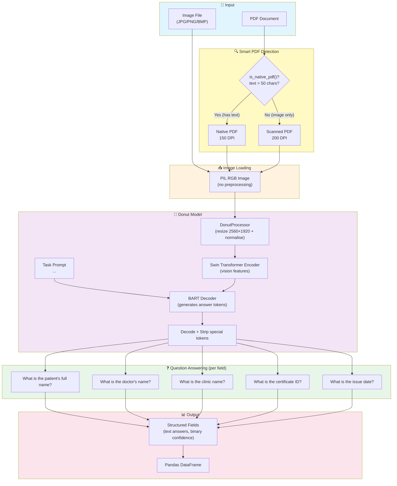

# Document Field Extraction using Donut (OCR-Free DocVQA)

Extracts structured fields (patient name, doctor name, clinic name, certificate ID, issue date) from medical certificates / sick notes using the `naver-clova-ix/donut-base-finetuned-docvqa` model — an OCR-free vision encoder-decoder that processes raw image pixels and generates answers as text.

## What the Model Does

`naver-clova-ix/donut-base-finetuned-docvqa` is a **Document Understanding Transformer (Donut)** fine-tuned on the **DocVQA dataset** for document visual question answering. Unlike LayoutLM, it requires no OCR step — it processes the raw image pixels directly using a **Swin Transformer encoder** and generates answers using a **BART-style decoder**.

**How it works:**
1. The image is encoded into feature vectors by the Swin Transformer vision encoder.
2. A task prompt `<s_docvqa><s_question>What is the patient name?</s_question><s_answer>` is tokenised.
3. The decoder generates answer tokens conditioned on both the image features and the prompt.
4. The generated sequence is decoded and cleaned to return plain text.

**Comparison with LayoutLM:**

| Approach | OCR Required | Image Features | Confidence Score | DocVQA F1 |
|---|---|---|---|---|
| `impira/layoutlm-document-qa` | ✅ Tesseract | ❌ Text + bbox only | ✅ Numeric (0–1) | ~70% |
| `naver-clova-ix/donut-base-finetuned-docvqa` | ❌ None | ✅ Raw pixels | ❌ Text only | ~84% |

## Key Features

- **OCR-free** — no Tesseract, no bounding boxes, no preprocessing pipelines
- **Zero-shot field extraction** — no training/fine-tuning required, just ask questions
- **Multi-question voting** — each field is queried with multiple phrasing variants; the first non-empty answer wins
- **Smart PDF handling** — detects native vs scanned PDFs and adapts DPI accordingly
- **Batch processing** — runs over an entire folder of images/PDFs and produces a pandas DataFrame
- **Lazy model loading** — the ~800 MB model loads once and is cached for the session
- **MIT license** — commercial-safe

## Architecture



### Model Details

| Property | Value |
|---|---|
| Model ID | `naver-clova-ix/donut-base-finetuned-docvqa` |
| Architecture | `VisionEncoderDecoderModel` (Swin Transformer encoder + BART decoder) |
| Processor | `DonutProcessor` (image normalisation + SentencePiece tokeniser) |
| Task prompt | `<s_docvqa><s_question>{question}</s_question><s_answer>` |
| Input | PIL RGB Image + question string |
| Output | Generated answer text (decoded token sequence) |
| Fine-tuned on | DocVQA dataset (~50K document image QA pairs) |
| DocVQA F1 | ~84% (vs ~70% for LayoutLM) |
| Size | ~800 MB |
| License | MIT |

## Notebook Walkthrough

**File:** `Document Field Extraction using Donut DocVQA.ipynb`

| Step | Purpose |
|---|---|
| **0. Environment Setup** | Adds project root to `sys.path`. No Tesseract setup needed. |
| **Configuration & Image Discovery** | Sets `IMAGE_FOLDER`, `INSPECT_INDEX`, `EXTENSIONS`; lists all matching files |
| **1. Helper Functions** | `is_native_pdf()`, `pdf_page_to_image()`, `load_image()` — no preprocessing pipelines |
| **2. Model Setup** | Lazily loads `DonutProcessor` + `VisionEncoderDecoderModel` (~800 MB, ~60–90s first call) |
| **3. Field Extraction** | `_FIELD_QUESTIONS`, `_ask_donut()`, `extract_fields_donut()` |
| **4. Inspect a Single Image** | Loads/displays one image and runs extraction with field indicators |
| **5. Batch Processing** | Runs extraction over every file in `IMAGE_FOLDER`, builds a `pandas.DataFrame` |
| **6. Summary Statistics** | Per-field extraction rate (%) across the batch |
| **Appendix** | Scratchpad for testing custom questions against the inspection image |

### Output Format

```python
{
    "patient_name": "John Smith",
    "patient_name_confidence": 1.0,     # 1.0 = answered, 0.0 = not found
    "doctor_name": "Dr. Anna Müller",
    "doctor_name_confidence": 1.0,
    "clinic_name": None,
    "clinic_name_confidence": 0.0,      # not found
    "certificate_id": "MC20072024ME008790",
    "certificate_id_confidence": 1.0,
    "issue_date": "17/08/2025",
    "issue_date_confidence": 1.0,
}
```

> **Note:** Confidence is binary (1.0 / 0.0) — Donut generates text answers and does not
> produce numeric confidence scores. A value of `1.0` means an answer was generated, not
> that the answer is certainly correct. Always visually verify results.

### Multi-Question Strategy

Each field has multiple question phrasings. The extractor tries each in order and returns
the first non-empty answer:

```
patient_name questions tried in order:
  1. "What is the patient's full name on this medical certificate?"  → "John Smith" ✓ (stop)
  2. "Who is the patient mentioned in this sick note?"               (skipped)
  ...
```

This is different from LayoutLM which tries all variants and keeps the highest-score answer.
For Donut, the first successful answer is used because there is no numeric score to compare.

## Prerequisites

```bash
pip install transformers torch pillow sentencepiece   # Donut model (~800 MB on first run)
pip install pymupdf                                    # PDF rendering
pip install pandas                                     # Results DataFrame
```

> **No Tesseract required.** Donut is fully OCR-free — it reads image pixels directly.

## Usage

1. Open `Document Field Extraction using Donut DocVQA.ipynb`.
2. Run cells top to bottom — Step 0 sets up imports, Configuration sets `IMAGE_FOLDER`.
3. Run Step 4 to sanity-check extraction on one image (`INSPECT_INDEX`).
4. Run Step 5 to batch-process the whole folder, then Step 6 for summary stats.
5. Use the Appendix cell to test custom questions (e.g. `"What is the diagnosis?"`).

### First Run

On the first run, the model (~800 MB) will be downloaded and cached:
- **macOS/Linux**: `~/.cache/huggingface/hub/`
- **Windows**: `C:\Users\<username>\.cache\huggingface\hub\`

Subsequent runs reuse the cached model — no re-download.
